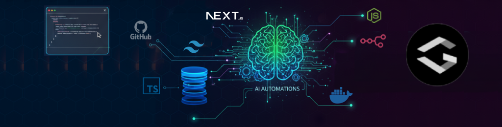

  
  
  
  
  
  
  
  
  

---

## 👨‍💻 About Me

🚀 **Passionate Full Stack Developer** with experience in modern web technologies

🎯 **Currently focusing on:** Next.js, TypeScript, and cloud technologies

🌱 **Always learning:** Best practices and emerging technologies

💡 **Love building:** Scalable applications and solving complex problems

🤝 **Open to:** Collaborating on interesting projects and contributing to open source

 

---

## 🛠️ Tech Stack & Tools

### 🚀 **Frontend Technologies**

### ⚡ **Backend & Database**

### 🔧 **Development Tools**

### ☁️ **Cloud & Deployment**

### 📦 **Package Managers & Others**

---

## 📊 GitHub Analytics

  

---

## 🤝 Let's Connect!

  
  
  
  <!--  -->
  
  
    
  
  
  
  <!-- ⭐ **If you find my projects interesting, consider giving them a star!** ⭐ -->
  

